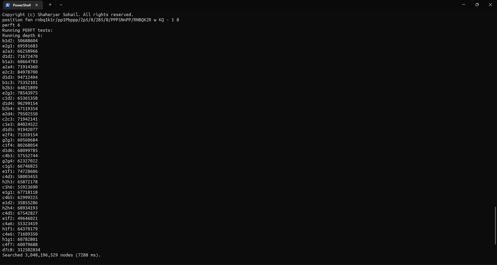

# StockNemo
A Chess Engine written in C# trying to find good moves like Stockfish.

## Features:
- Beautiful CLI:

- One of the fastest engine PERFT:

### Much thanks to:
- [Cozy Chess](https://github.com/analog-hors/cozy-chess) by Analog Hors for
providing necessary information and data regarding Fixed-Shift Black Magic
BitBoards.
- [Smallbrain](https://github.com/Disservin/Smallbrain) by Disservin for
providing necessary information and data regarding constant attack tables and
check/pin bitboards. Smallbrain and Disservin have been crucial to the
progress made by StockNemo.
- [Stockfish](https://github.com/official-stockfish/Stockfish) by the
Stockfish Team for providing numerous insights and making a brilliant engine,
used numerous times to debug StockNemo.
