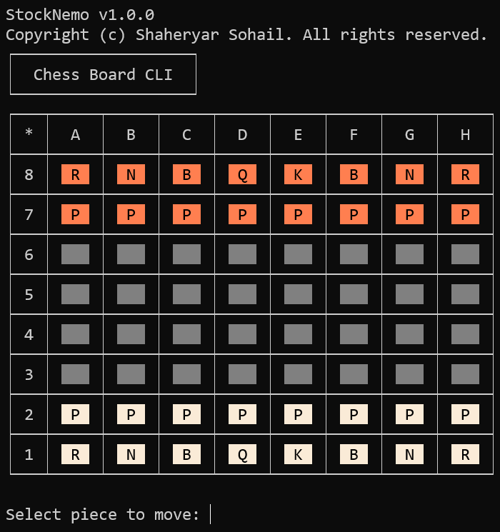
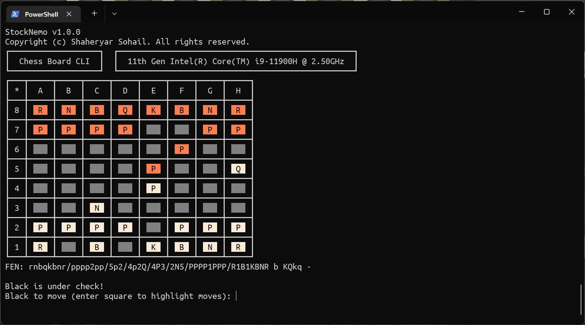
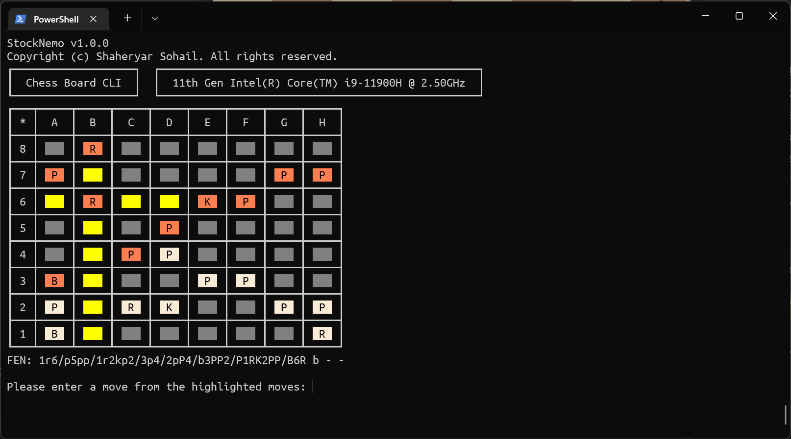

# StockNemo
A Chess Engine written in C# trying to find good moves like Stockfish.

Play vs StockNemo on <a href="https://lichess.org/?user=StockNemo#friend">Lichess!</a> 

Checkout the rated <a href="https://lichess.org/@/StockNemo/rated">game archive.</a>

Checkout the <a href="https://github.com/TheBlackPlague/StockNemo-SelfPlay/blob/main/2.0.0.3/GAMES.md"> self-play games.</a> 
 
Featured Games: [Watch](FEATUREDGAMES.md)

## Features:
- UCI Compatible
- Beautiful CLI:

|  |  |
|------------------------------------------------------------------|------------------------------------------------------------------|


- One of the fastest engine PERFT:
```csharp
position fen 8/2p5/3p4/KP5r/1R3p1k/8/4P1P1/8 w - -
perft 11
Running PERFT @ depth 11:
a5a4: 1201827680136
a5a6: 1355148667403
b4a4: 1008655489960
b4b1: 1716821664250
b4b2: 1049413031768
b4b3: 1228179918985
b4c4: 1463151281937
b4d4: 1324944943461
b4e4: 1126470725027
b4f4: 258287648492
e2e3: 872169979347
e2e4: 646956903053
g2g3: 362361958827
g2g4: 1007073431028
Searched 14,621,463,323,674 nodes (86861 ms). TT: 1259040447 hits.
Speed: 168.3B nps.
```

### Much thanks to:
- [Cozy Chess](https://github.com/analog-hors/cozy-chess) by Analog Hors for
providing necessary information and data regarding Fixed-Shift Black Magic
BitBoards.
- [Smallbrain](https://github.com/Disservin/Smallbrain) by Disservin for
providing necessary information and data regarding constant attack tables and
check/pin bitboards. Smallbrain and Disservin have been crucial to the
progress made by StockNemo.
- [Stockfish](https://github.com/official-stockfish/Stockfish) by the
Stockfish Team for providing numerous insights and making a brilliant engine,
used numerous times to debug StockNemo.
