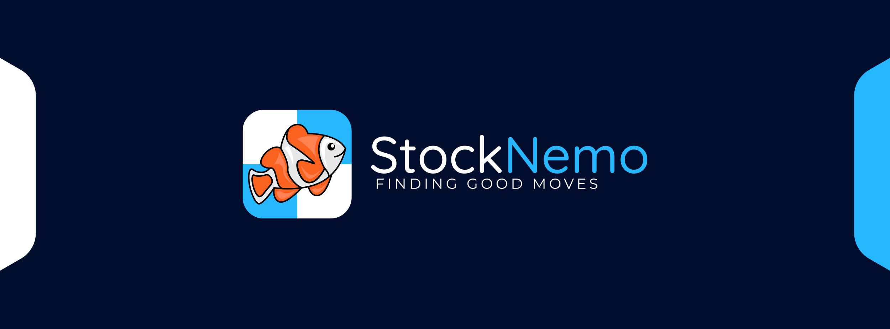

<h1 align="center">
	
</h1>

<h3 align="center">
	C# Chess Engine - Finding Good Moves like Stockfish
</h3>

<p align="center">
	<strong>
		<a href="https://github.com/TheBlackPlague/StockNemo/releases">Releases</a>
	</strong>
</p>

<p align="center">
<a href="https://www.runpod.io/">

</a>
</p>

<p align="center">
<a href="https://dotnet.microsoft.com/en-us/download">

</a>
<a href="https://github.com/TheBlackPlague/StockNemo/pkgs/container/stocknemo">

</a>
<a href="https://lichess.org/@/StockNemo">

</a>
</p>

<p align="center">
<a href="https://github.com/TheBlackPlague/StockNemo/actions">

</a>

<a href="https://github.com/TheBlackPlague/StockNemo/actions">

</a>
</p>

## Overview
* **Strong, Powerful, and Deep Analysis**
* **High Performant and Cross-Compatible**
* **Documented Source Code**
* **Free and Open Source**

## Features
* **Engine:**
  * **Evaluation:**
    * Material Development Evaluation
      * Material Evaluation
      * Piece Development Evaluation
    * Bishop Pair Evaluation
    * Tapered Evaluation
      * Early Game
      * Late Game
    * Neural Network Evaluation
      * Tempo Sensitive
      * Perspective Evaluation
  * **Move Policy (Move Ordering)**:
    * Transposition Table Move (Normal Move Generation)
    * Promotion Move
      * Promotion Type
    * Capture Move
      * Most Valuable Victim with Least Valuable Attacker (MVVLVA)
  * **Search:**
    * Cancellation Support
    * Iterative Deepening
      * Depth Data Output
      * Principle Variation Output
    * Aspiration Search
      * Narrow Windows
      * Bound-specific Widening
      * Fallback Threshold
    * Alpha-Beta Negamax
      * Three-fold Repetition Pruning
      * Mate Distance Pruning
      * Material Draw Pruning
        * KvK
        * NKvK and KvNK
        * BKvK and KvBK
      * Transposition Table
        * Exact Cutoff
        * Alpha Unchanged Update
        * Beta Cutoff Update
        * Alpha Beta Delta Cutoff
      * Reverse Futility Pruning
        * Up to six-ply
        * None on mate branches
        * Depth and Improving Dependent Margin
      * Razoring
        * QSearch Evaluation
        * Shallow Threshold
      * Null Move Pruning
        * Three-ply Depth Reduction
        * Non-Razoring Depth
      * Check Extension
      * Fail-soft Alpha Beta Pruning
        * Futility Pruning
          * Evaluation Dependent
          * Alpha Dependent
        * Late Move Pruning
          * Post Best Move Found
          * Quiet Move Threshold
          * Non Principle Variation Branches
          * Up to three-ply
        * Late Move Reduction
          * Depth and Moves Played Logarithmic Reduction
          * At least three-ply
        * Principle Variation Search
          * Full Search on First Move 
    * Quiescence Search (QSearch)
      * 
      * Static Evaluation
        * Beta Cutoff
        * Alpha Update
      * Deep Capture Only Search
      * Fail-soft Alpha Beta Pruning
        * Static Exchange Evaluation (SEE) Pruning
* **Utility:**
  * PERFT (Speeds upto: **168.3B NPS**)
    * PERFT-Divide Output
    * Smart Multi-threaded Algorithm
      * Single-threaded (Depth < 5)
      * Multi-threaded (Depth >= 5)
        * Depth-First (Depth > 5)
        * Breath-First (Depth = 5)
    * Large In-Memory Transposition Table (50 GB) [SUPPORTED HARDWARE ONLY]

### Building from Source
It is recommended that you do not build from source and instead download a 
release binary. The `master` branch, as well as other branches are in no shape,
or form, guaranteed to be production-ready or stable. 

Given the risks, if you still wish to continue, please note that you require the
following:
- [.NET 6 SDK](https://dotnet.microsoft.com/en-us/download/dotnet/6.0)
- Hardware Compatible with .NET 6 SDK (While .NET 6 is compatible with most hardware, 
the project does not guarantee compatibility)
- System RID (Runtime Identifier) from the .NET Docs
  - [Windows](https://docs.microsoft.com/en-us/dotnet/core/rid-catalog#windows-rids)
  - [Linux](https://docs.microsoft.com/en-us/dotnet/core/rid-catalog#linux-rids)
  - [macOS](https://docs.microsoft.com/en-us/dotnet/core/rid-catalog#macos-rids)
  - [iOS](https://docs.microsoft.com/en-us/dotnet/core/rid-catalog#ios-rids)
  - [Android](https://docs.microsoft.com/en-us/dotnet/core/rid-catalog#android-rids)

In the repository directory, go into the Terminal directory and run:

```
dotnet publish "Terminal.csproj" -c Release -r <RID> /p:PublishSingleFile=true --self-contained true
```

You may then find the compiled binary in `Terminal/bin/Release/net6.0/<RID>/publish`.

### Contributing Code and Hardware
Glad you're considering helping the development of StockNemo. Being an
opensource-freeware project, it is currently not sponsored by any company,
person, or otherwise. StockNemo welcomes all good code contributions 
(given they follow all necessary code and documentation standards).

To assist development of StockNemo, StockNemo appreciates donate of any
compute power. Contributors may donate idle hardware by installing and
running a StockNemo Testing Framework worker, which will be assigned 
distributed tasks to run. The hardware is required to be connected to the
internet, and available to run tests (CPU is mostly idle). **The Framework
currently only utilizes the CPU.**

### Much thanks to:
- [Cozy Chess](https://github.com/analog-hors/cozy-chess) by Analog Hors for
providing necessary information and data regarding Fixed-Shift Black Magic
BitBoards.
- [Smallbrain](https://github.com/Disservin/Smallbrain) by Disservin for
providing necessary information and data regarding constant attack tables and
check/pin bitboards. Smallbrain and Disservin have been crucial to the
progress made by StockNemo.
- [Stockfish](https://github.com/official-stockfish/Stockfish) by the
Stockfish Team for providing numerous insights and making a brilliant engine,
used numerous times to debug StockNemo.
- [OpenBench](https://github.com/AndyGrant/OpenBench) by Andrew Grant for making
an amazing framework that allows distributed testing of StockNemo.
- [Chess Tuning Tools](https://github.com/kiudee/chess-tuning-tools) by Karlson 
Pfannschmidt for being an amazing utility software to tune StockNemo.
- [Runpod](https://www.runpod.io/) by Runpod Team for providing necessary hardware to
test StockNemo.
- [Marlinflow](https://github.com/dsekercioglu/marlinflow) by the Marlinflow Team
for providing the bulk of what is StockNemo's current neural network trainer.
- [Berserk](https://github.com/jhonnold/berserk) by Jay for providing an amazing
engine that can be used to generate neural network training data for StockNemo.
