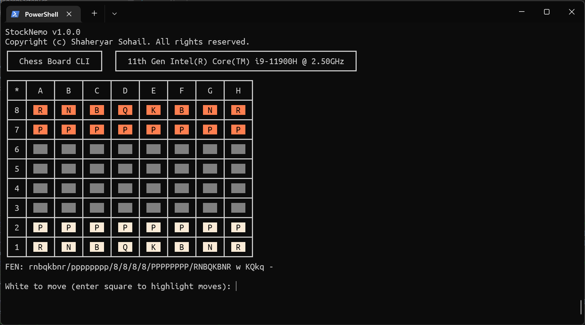

# StockNemo
A Chess Engine written in C# trying to find good moves like Stockfish.

## Features:
- Beautiful CLI:




- One of the fastest engine PERFT:
```csharp
perft 9
Running PERFT @ depth 9:
a2a3: 74950758099
a2a4: 101265301849
b1a3: 85849641909
b1c3: 109418317145
b2b3: 96577095997
b2b4: 97442160946
c2c3: 108697368719
c2c4: 120549219832
d2d3: 176976245463
d2d4: 227220482342
e2e3: 259522947791
e2e4: 263561543780
f2f3: 68094899093
f2f4: 84792070664
g1f3: 108393009416
g1h3: 86659653631
g2g3: 99646370024
g2g4: 92281289941
h2h3: 74778417365
h2h4: 102853440161
Searched 2,439,530,234,167 nodes (238777 ms). TT: 615532811 hits.
Speed: 10.2B nps.
```

### Much thanks to:
- [Cozy Chess](https://github.com/analog-hors/cozy-chess) by Analog Hors for
providing necessary information and data regarding Fixed-Shift Black Magic
BitBoards.
- [Smallbrain](https://github.com/Disservin/Smallbrain) by Disservin for
providing necessary information and data regarding constant attack tables and
check/pin bitboards. Smallbrain and Disservin have been crucial to the
progress made by StockNemo.
- [Stockfish](https://github.com/official-stockfish/Stockfish) by the
Stockfish Team for providing numerous insights and making a brilliant engine,
used numerous times to debug StockNemo.
